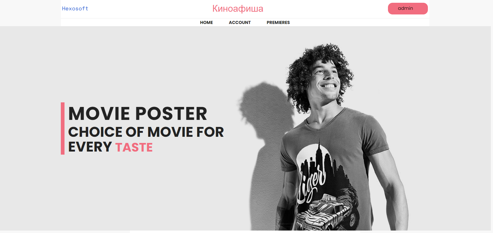
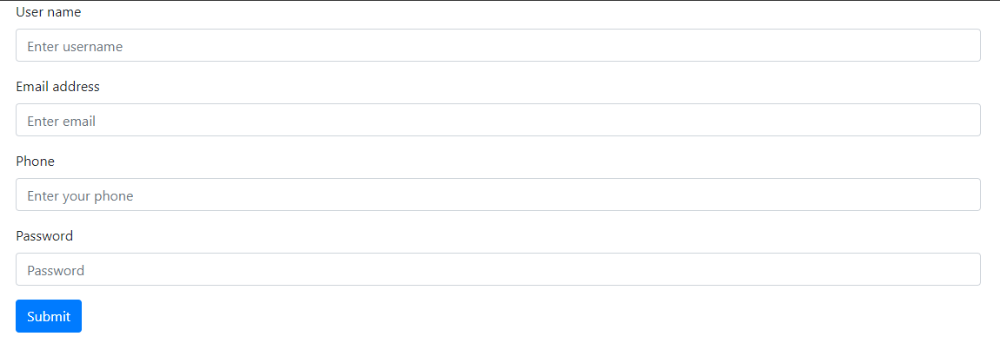
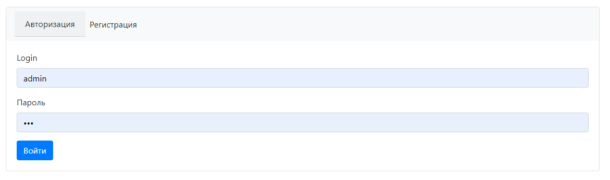
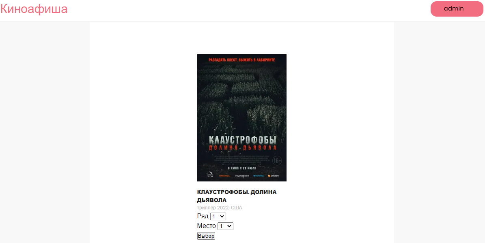
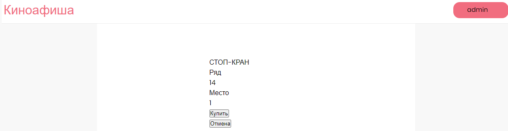

# Сервис по продаже билетов в кинотеатр.

Данное приложение иллюстрирует покупку билетов в кинотеатр.

Стек технологий: 


Перед запуском установите:
- Java 17
- Apache Maven 3.x
- PostgreSQL 14

## Запуск приложения

1. Создать бд:
```sql
    create database cinema;
```
2. Запуск приложения с maven. Перейдите в корень проекта через командную строку и выполните команды:
```
    mvn clean install
    mvn spring-boot:run
```
### Основная страница со всеми объявлениями и функционалом:



### Страницы с авторизацией и аутентификацией пользователя:



### Страницы с выбором места и оформлением билета:



### Контакты:

email: danya.nikisha@mail.ru


